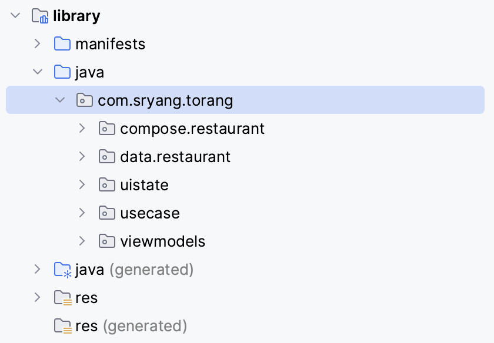

# Restaurant Module

## Convention

### package

### function
- Restaurant + Nav +Screen
- Restaurant + Gallery + Screen
- Restaurant + BasicInfo + Screen
- Restaurant + Reviews + Screen
- Restaurant + Menu + Screen

## Case

## Architecture

### UI Layer

#### UI element
UI elements such as activities and fragments that display the data

#### UI state
The UI state is what the app says they should see.

#### State holder(ViewModel)
Responsible for the production of UI state and contain the necessary logic for that task

## Illustrating cycle of event

## UnitTest

## What was difficult

## Preview